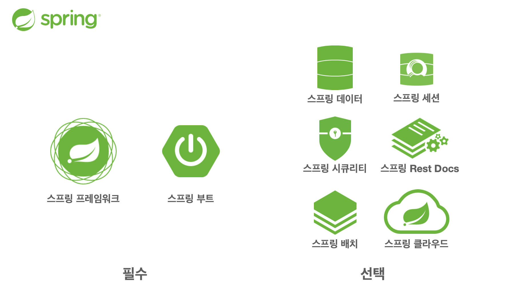
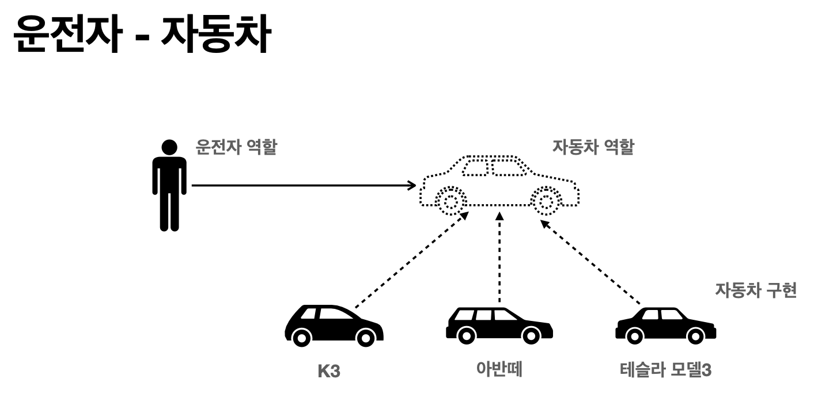
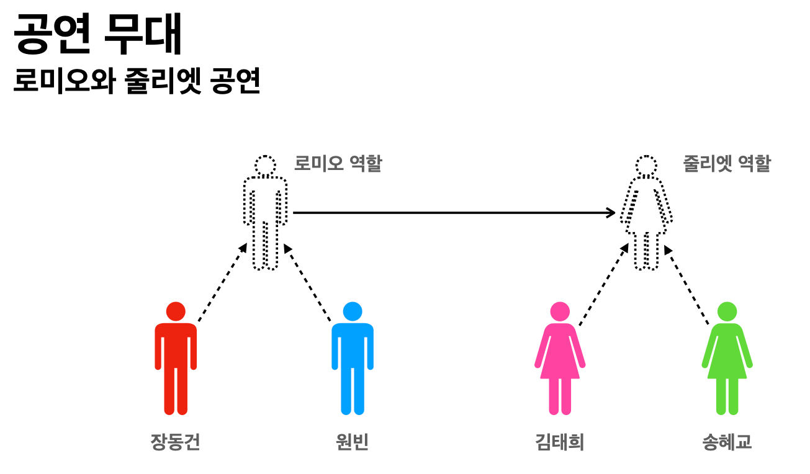
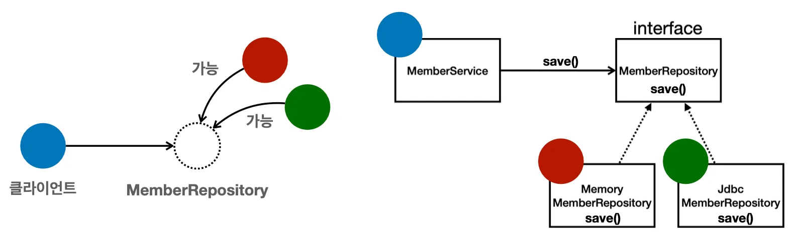

# ch.01 객체지향 설계와 스프링 


### Spring Framework
- **핵심 기술**: 스프링 DI 컨테이너, AOP, 이벤트, 기타
- **웹 기술**: 스프링 MVC, 스프링 WebFlux
- **데이터 접근 기술:** 트랜잭션, JDBC, ORM 지원, XML 지원
- **기술 통합:** 캐시, 이메일, 원격접근, 스케줄링
- **테스트:** 스프링 기반 테스트 지원
- **언어:** 코틀린, 그루비
- 최근에는 스프링 부트를 통해서 스프링 프레임워크의 기술들을 편리하게 사용

### Spring Boot

- **스프링을 편리하게 사용할 수 있도록 지원, 최근에는 기본으로 사용**
- 단독으로 실행할 수 있는 스프링 애플리케이션을 쉽게 생성
- Tomcat 같은 웹 서버를 내장해서 별도의 웹 서버를 설치하지 않아도 됨
- 손 쉬운 빌드 구성을 위한 Starter 종속성 제공
- 스프링과 3rd party(외부) 라이브러리 자동 구성
- 메트릭, 상태 확인, 외부 구성 같은 프로덕션 준비 기능 제공
- 관례에 의한 간결한 설정

### 스프링의 진짜 핵심

- 스프링은 자바 언어 기반의 프레임워크
- 자바 언어의 가장 큰 특징 - **객체 지향 언어**
- 스프링은 객체 지향 언어가 가진 강력한 특징을 살려내는 프레임워크
- 스프링은 좋은 객체 지향 애플리케이션을 개발할 수 있게 도와주는 프레임워크

### **객체 지향 특징**

- 추상화
    - 클래스나 인터페이스를 통해 공통적인 특징만 정의하고, 세부 구현은 이를 상속하거나 구현한 클래스에서 담당하도록 하는 것, `abstract`, `interface` 로 구현
- 캡슐화
    - 클래스의 필드(멤버 변수)를 `private` 로 선언하고 `getter`, `setter` 를 통해 외부에서 제어하도록 설계 데이터를 안전하게 보호하고 불필요한 접근을 차단.
- 상속
    - 기존 클래스(`superclass`) 의 필드와 메서드를 자식 클래스(`subclass`)에서 재사용하거나 확장 할 수 있는 기능. 자바에서는 `extends` 키워드를 사용
- 다형성
    - 부모 클래스 타입으로 자식 클래스를 다룰 수 있으면, 같은 메서드가 오버라이딩을 통해 다르게 동작.
      자바에서는 메서드 오버로딩, 오버라이딩, 그리고 인터페이스 구현으로 실현

### 객체 지향 프로그래밍

- 객체 지향 프로그래밍은 컴퓨터 프로그램을 명령어의 목록으로 보는 시각에서 벗어나 여러개의 독립된단위, 즉 “객체”들의 모임으로 파악하고자 하는 것이다. 각각의 객체는 메시지를 주고 받고, 데이터를 처리할 수 있다.(협력)
- 객체 지향 프로그래밍은 프로그램을 유연하고 변경이 용이하게 만들기 떄문에 대규모 소프트웨어 개발에 많이 사용된다.

### **다형성** : **객체 지향의 핵심**

- 역할과 구분으로 세상을 구분

- 자동차의 브랜드가 어떻든 자동차의 역할을 변화하지 않고 자동차의 역할을 수행한다.
  
- 로미오와 줄리엣을 연기하는 배우가 누구든 로미오와 줄리엣의 역할은 변화하지 않는다.

### 역할과 구현을 분리 : 자바언어

- 자바 언어의 다형성을 활용
    - 역할 = 인터페이스
    - 구현 = 인터페이스를 구현한 클래스, 구현 객체
- 객체를 설계할 때 역할과 구현을 명확히 분리
- 객체 설계시 역할(인터페이스)를 먼저 부여하고, 그 역할을 수행하는 구현 객체 만들기

정리

- 실세계의 역할과 구현이라는 편리한 컨셉을 다형성을 통해 객체 세상으로 가져올 수 있음
- 유연하고, 변경이 용이
- 확장 가능한 설계
- 클라이언트에 영향을 주지 않는 변경 가능
- 인터페이스를 안정적으로 잘 설계하는 것이 중요

```java
public class MemberService() {
    private MemberRepository memberRepository = new MemberService();
}
//------------------------------------
public class MemberService() {
    private MemeberRepository memberRepository = new JdbcMemberRepository(); 
}
```
- MemberService 클라이언트가 구현 클래스를 직접 선택
    - MemberRepository m = new MemoryMemberRepository(); // 기존코드
    - MemberRepository m = new JdbcMemberRepository();      // 변경코드
- 구현 객체를 변경하려면 클라이언트 코드를 변경해야 한다.
- 분명 다형성을 사용했지만 OCP 원칙을 지킬 수 없다.
- 객체를 생성하고, 연관관계를 맺어주는 별도의 조립, 설정자가 필요하다.

### LSP(Liskov substitution principle)

- 프로그램의 객체는 프로그램의 정확성을 깨뜨리지 않으면서 하위 타입의 인스턴스로 바꿀 수 있어야 한다.
- 다형성에서 하위 클래스는 인터페이스 규약을 다 지켜야 한다는 것, 다형성을 지원하기 위한 원칙, 인터페이스를 구현한 구현체는 믿고 사용하려면 , 이 원칙이 필요하다.
- 단순히 컴파일에 성공하는 것을 넘어서 이야기

### ISP(Interface segregation principle)

- 특정 클라이언트를 위한 인터페이스 여러 개가 범용 인터페이스 하나보다 낫다.
- 자동차 인터페이스 → 운전 인터페이스, 정비 인터페이스로 분리
- 사용자 클라이언트 → 운전자 클라이언트, 정비사 클라이언트로 분리
- 분리하면 정비 인터페이스 자체가 변해도 운전자 클라이언트에 영향을 주지 않음
- 인터페이스가 명확해지고, 대체 가능성이 높아진다.

### DIP(Dependency inversion principle)

- 프로그래머는 “추상화에 의존해야지, 구체화에 의존하면 안된다.” 의존성 주입은 이 원칙을 따르는 방법중 하나다.
- 쉽게 이야기해서 구현 클래스에 의존하지 말고, 인터페이스에 의존하라는 뜻
- 앞에서 이야기한 역할(Role)에 의존하게 해야 한다는 것과 같다. 객체 세상도 클라이언트가 인터페이스에 의존해야 유연하게 구현체를 변경할 수있다. 구현체에 의존하게 되면 변경이 아주 어려워 진다.

정리

- 객체 지향의 핵심의 다형성
- 다형성 만으로 쉽게 부품을 갈아 끼우듯이 개발할 수 없다.
- 다형성 만으로는 구현 객체를 변경할 때 클라이언트 코드도 함께 변경된다.
- 다형성만으로 OCP, DIP를  지킬 수 없다.

---

### 스프링 이야기에 왜 객체 지향 이야이가 나오는가?

- 스프링은 다음 기술로 → 다형성 + OCP, DIP 를 가능하게 지원
- DI(Dependency Injection) : 의존관계, 의존성 주입
- DI 컨테이너 제공
- 클라이언트 코드의 변경없이 기능 확장
- 쉽게 부품을 교체하듯이 개발

정리

- 모든 설계에 **역할**과 **구현**을 분리하자.
- 자동차, 공연의 예를 떠올려보자.
- 애플리케이션 설계도 공연을 설계 하듯이 배역만 만들어두고, 배우는 언제든지 **유연**하게 **변경**할 수 있도록 만드는 것이 좋은 객체 지향 설계다.
- 이상적으로는 모든 설계에 인터페이스를 부여하자